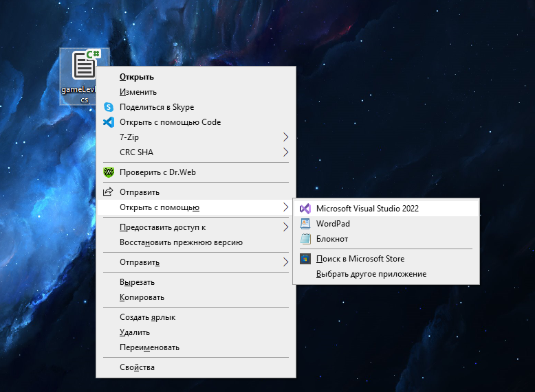
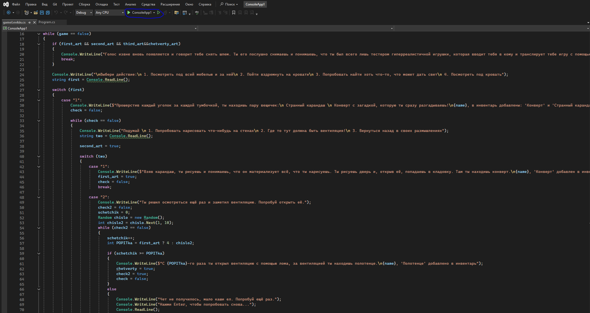

![Логотип](https://yandex-images.clstorage.net/ieg9j6386/bd9234VPC1/OOkyr6pfOujwwCXoI5AjPq2pXSUqy-GjIyLr6iNWnYkonXcffDQQ0FqiyCaOGfUpL65BWMGdDgHBS7zRbFbq53--fvnhAX3o9dRu4m-KLy645UBmP4n4pyR75-lPMb2sCaEOfAJDO_0V8sck31XvOGzCeBzFzQFS8jbL_VMMlY4E-iueiEtm1dnbTvUElDY_oehXIge1_8ouDIyRYxqbjzmYKFQBRhHWOdLzA_t8rwxR90RyzMAdeeQB-9lPEbufIvknhaJuRen_-0PGNLIjOJfmeTQRs-LbOhS1qEMGipsdpilIM0k82gPU_BP-eZkyW9lpZcDxBGDzO9XiRQ2QvgniKoW2e0DX5PFn6wSSISGfwVUVLInJ6DocmpdzHpSiM6QSVwlNH_cp9OsayUCkH3b7U1naxg1Z7Cbk7WU0uKQLyRC4j397ye7mSvsknTEapddGIxys7OUJDKyZZAi1vAOdMmMZVDvpP_z9AdhouQR89XBW8OsGYeswzuFUMa-RA8MIjbpiR9H16UzmEK4kGoHuaiE8sf_XIQO-iUgLjagpiQdCAVIx8Rjm3RDJRIkGSM9pZPrLPWTqO-jCZDC8gQDYAI2ZbkTH7NxK0zSsNC265GcnFpLe6g8glK93B6uEIpwgWRhmIdoC5fA22H2NO1_-al7W3Cx40AbGyUcMj50Z_DGKl1hi3_bcXcs1igg3kdBnCCee68UaCYa9QSCWoxuJI2s5aDDYI9LrD_RAlytf2U9z5_Qucs8h9OxmE7uEP-wClLt-dv_45G7lDKsPPaHVRQgOqNLWHxWMmHE7k78uigxcA2c11grCwCXqS7saSvtydMToMmfIPPbiTzG3sALmErq8dXH20PhfxzubAw6j_0ABMqrk_Sgfv71VDZe5GrIkRyBiOssg-d0NyGKjGXftSnD64QZ54Qvu_2gRkZYhxgm9m1ZYzdXwSOUnnAEXsOxFBju13fA6KqW8fSw)

# Myproject
Индивдуальный проект по теме: Создание игры в консоле на языке С#
##
# Суета   - название моего проекта 
это игрушка буквально на пару минут , оформленная внутри консоли , с небольшими механиками вроде зависимости артефактов и действий , открытие вентиляции и тп и тп.

+ Для того что бы поиграть в мою игру будет достаточно скачать Visual Studio Code 2022 с поддержкой языка C#
+ А для того что бы запустить нужно скачать мой код (или же просто его скопировать ) и открыть с помощью Visual Studio Code 2022

+ После установки, просто запускаешь компиляцию кода и играешь)
